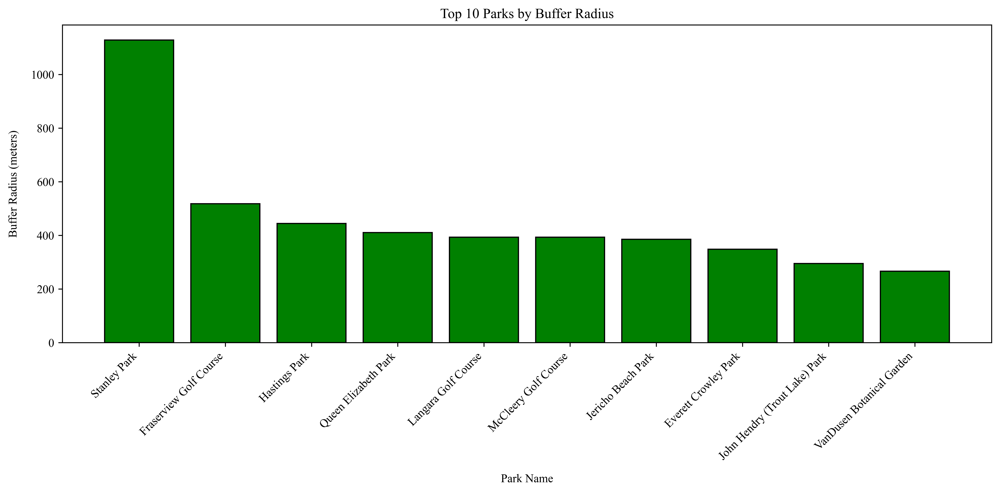
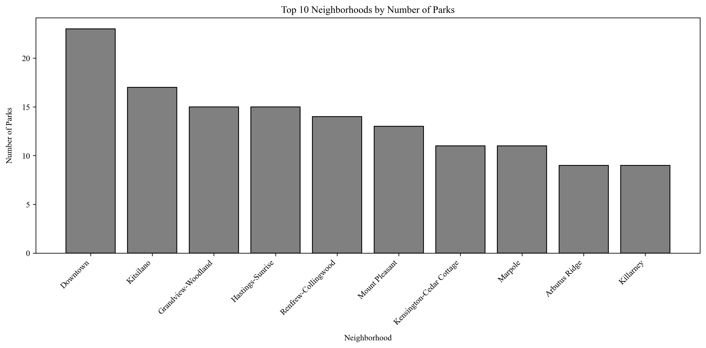

# Vancouver Parks Spatial Analysis 

This project analyzes public parks in Vancouver using spatial data and Python.

## What It Includes
- Top 10 largest parks by area (hectares)
- Circular buffer zones based on park size
- Park boundaries and neighborhood overlay
- Bar charts for:
  - Top 10 parks by buffer radius
  - Top 10 neighborhoods by number of parks

## Tools Used
- Python
- GeoPandas
- Matplotlib
- Contextily
- NumPy

## Files
- `final_script.py`: Main analysis and visualization
- `parks.geojson`: Park point locations
- `parks-polygon-representation.geojson`: Park boundaries
- `local-area-boundary.geojson`: Neighborhood boundary data
- PNG output images of maps and charts

## Output Previews

### Map: Top 10 Parks, Buffers & Neighborhood Boundaries

### Bar Chart: Top 10 Parks by Buffer Radius

### Bar Chart: Top 10 Neighborhoods by Number of Parks

---

## 📌 Author
**Muhammad Uzair**  
*July 2025*

